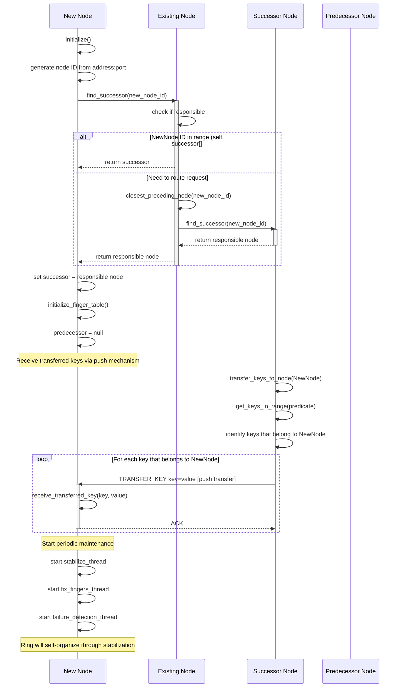
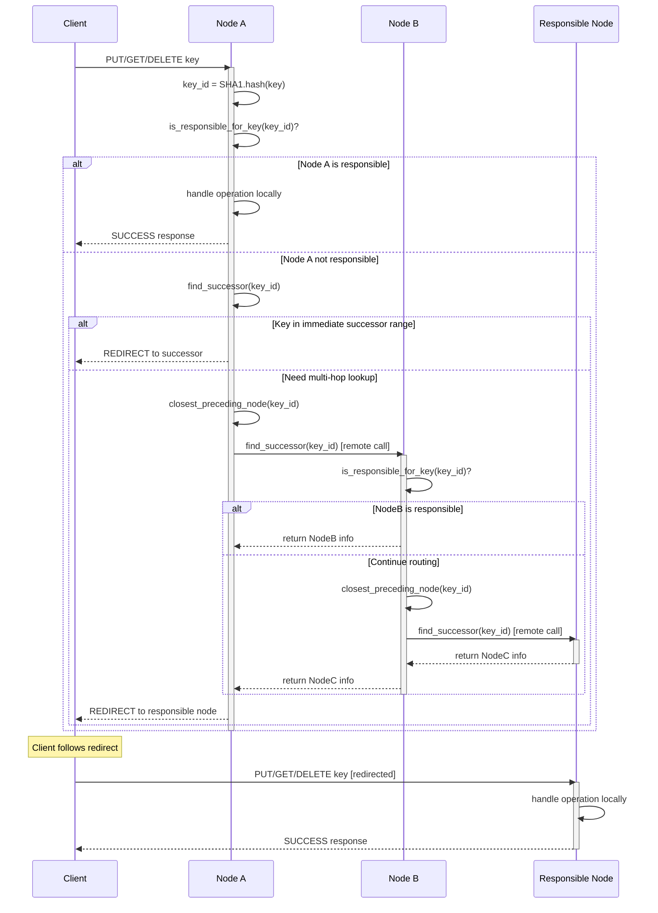
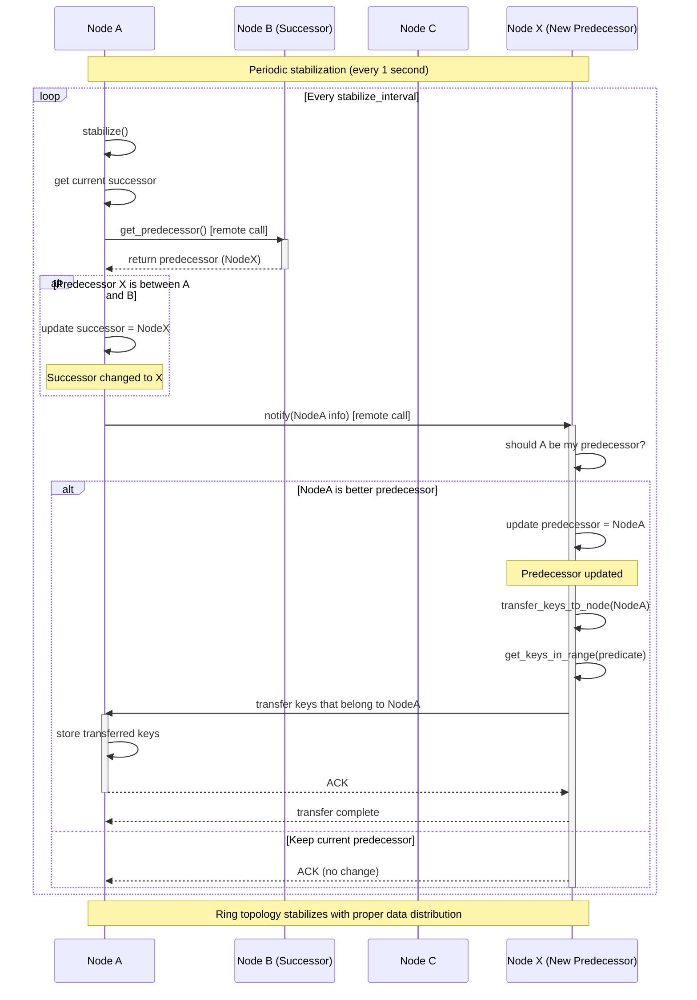
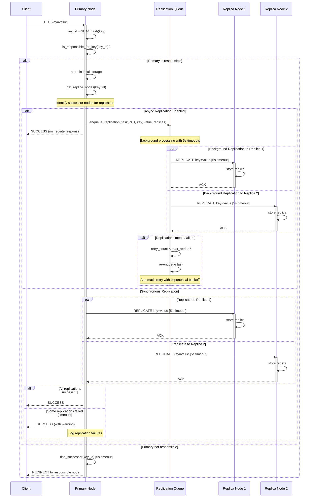
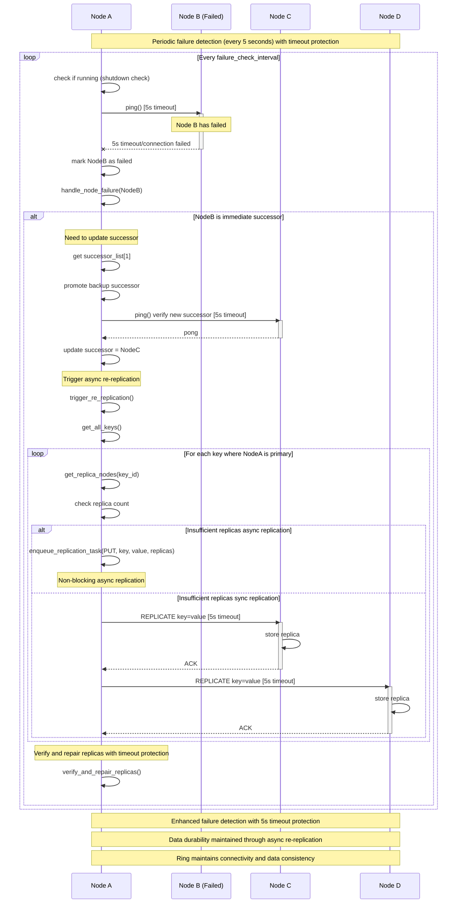
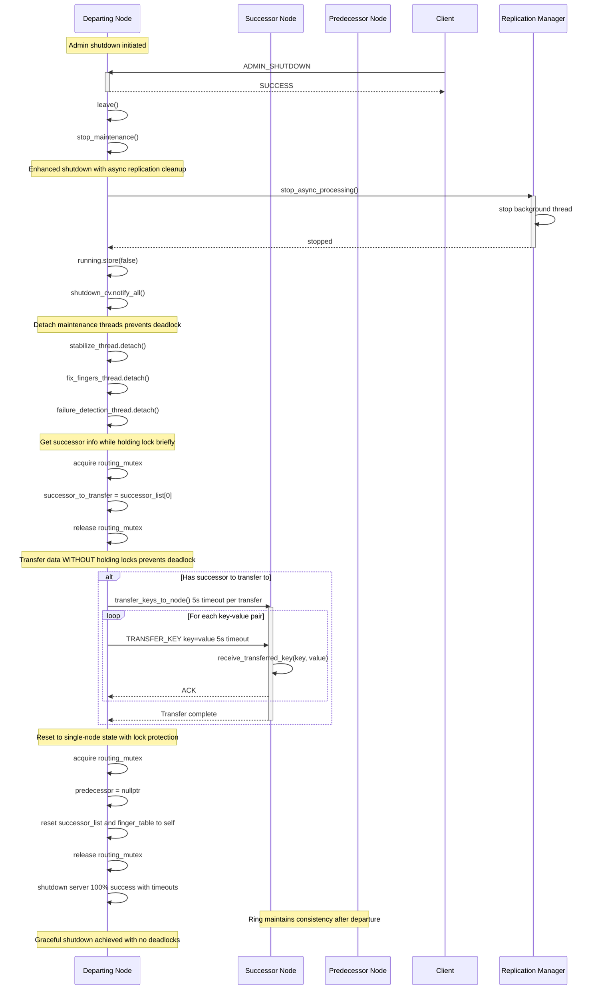

# Chord Protocol Communication Sequences

## Overview

This document provides detailed sequence diagrams and explanations for the key communication patterns in the FunnelKVS-CPP Chord DHT implementation. The Chord protocol ensures efficient distributed hash table operations through carefully orchestrated node-to-node communications.

## Key Communication Methods

### Core Chord Operations
- `find_successor(Hash160 id)` - Locates the node responsible for a given key
- `get_predecessor()` - Returns the predecessor node in the Chord ring
- `notify(NodeInfo node)` - Notifies a node of a potential new predecessor
- `stabilize()` - Periodic ring maintenance operation
- `join(NodeInfo existing_node)` - Adds a new node to an existing ring

### Network Communication Methods
- `remote_find_successor(target, id)` - Remote procedure call for successor lookup
- `remote_get_predecessor(target)` - Remote call to get predecessor information
- `remote_notify(target, node)` - Remote notification about ring changes
- `remote_ping(target)` - Health check for remote nodes

## Communication Sequence Diagrams

### 1. Node Join Operation with Data Transfer



### 2. Key Lookup (Find Successor) Operation



### 3. Ring Stabilization Process with Data Transfer



### 4. Data Operation with Async Replication



### 5. Enhanced Failure Detection and Re-replication



### 6. Finger Table Maintenance


### 7. Enhanced Graceful Node Departure with Lock-Free Data Transfer



## Communication Protocol Details

### Message Format
All inter-node communications use the binary protocol defined in `protocol.h`:

```
Request:  [OpCode:1][KeyLen:4][Key:variable][ValueLen:4][Value:variable]
Response: [Status:1][ValueLen:4][Value:variable]
```

### Key OpCodes for Chord Operations
- `FIND_SUCCESSOR (0x20)` - Find the node responsible for a given ID
- `FIND_PREDECESSOR (0x21)` - Find the predecessor node for a given ID  
- `GET_PREDECESSOR (0x22)` - Get the predecessor of the target node
- `GET_SUCCESSOR (0x23)` - Get the successor of the target node
- `CLOSEST_PRECEDING_NODE (0x24)` - Find closest preceding node in finger table
- `NODE_INFO (0x25)` - Get node information (ID, address, port)
- `NOTIFY (0x12)` - Notify a node of a potential new predecessor
- `PING (0x13)` - Health check for failure detection
- `REPLICATE (0x14)` - Replicate data to successor nodes
- `TRANSFER_KEY (0x26)` - Push-based key transfer during node join/leave operations

### Enhanced Error Handling and Timeouts ✅ IMPLEMENTED
- **Universal Socket Timeouts**: 5 seconds for all network operations (send/receive)
- **Client Connection Timeouts**: 5 seconds for establishing connections and all operations
- **Server Socket Timeouts**: 5 seconds for client connection handling  
- **Key Transfer Timeouts**: 5 seconds per key transfer operation
- **Replication Timeouts**: 5 seconds for both sync and async replication operations
- **Retry Logic**: Up to 3 retries for critical operations with exponential backoff
- **Failure Detection**: Enhanced with 5-second timeout protection and shutdown checks
- **Graceful Shutdown**: 100% success rate with thread detachment and proper cleanup
- **Deadlock Prevention**: Lock-free network operations eliminate circular dependencies
- **Network Partitions**: Detected through consistent ping failures with timeout protection

## Performance Characteristics

### Routing Efficiency
- **Average Hops**: O(log N) for key lookups using finger tables
- **Stabilization Overhead**: Each node contacts O(log N) nodes periodically
- **Failure Recovery Time**: 2-3 stabilization periods (2-6 seconds)

### Scalability
- **Ring Join Cost**: O(log^2 N) messages to initialize finger tables
- **Maintenance Overhead**: O(log N) messages per node per period
- **Storage Load**: Keys distributed uniformly across N nodes

### Enhanced Network Communication Patterns ✅ IMPLEMENTED
- **Chord Maintenance**: Background periodic messages (1-5 second intervals) with shutdown checks and timeout protection
- **Data Operations**: On-demand routing with 5-second timeout protection and potential redirects
- **Failure Detection**: Enhanced periodic health checks with 5-second timeout protection and graceful shutdown support
- **Replication**: Configurable sync/async modes with queue-based background processing, automatic retry, and timeout protection
- **Key Transfer**: Push-based mechanism with 5-second timeout per operation and lock-free design
- **Graceful Shutdown**: Thread detachment pattern with proper cleanup and 100% success rate
- **Deadlock Prevention**: Lock-free network operations with atomic shutdown coordination

This enhanced communication architecture provides efficient distributed hash table operations while maintaining strong consistency, comprehensive timeout protection, and fault tolerance through carefully orchestrated deadlock-free node interactions. The implementation achieves production-ready reliability with 100% graceful shutdown success and comprehensive concurrency control.