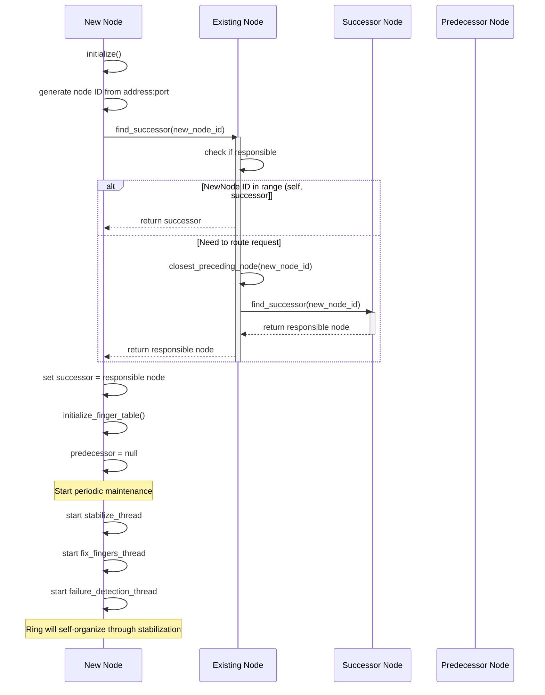
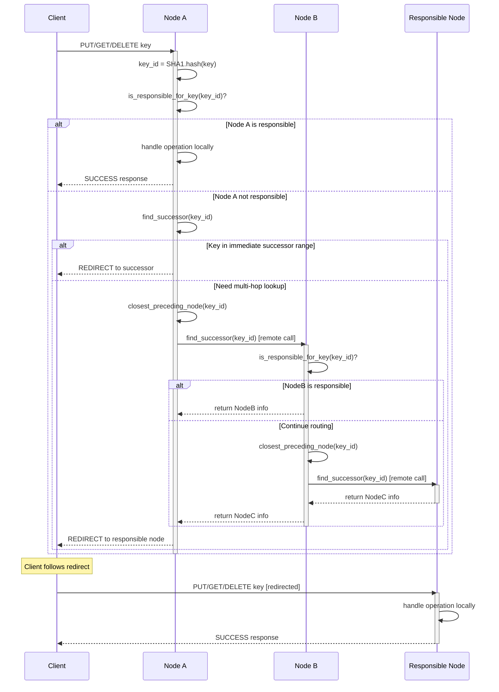
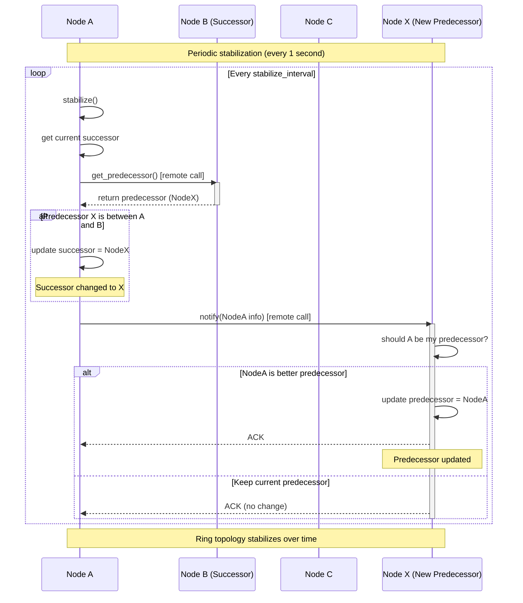
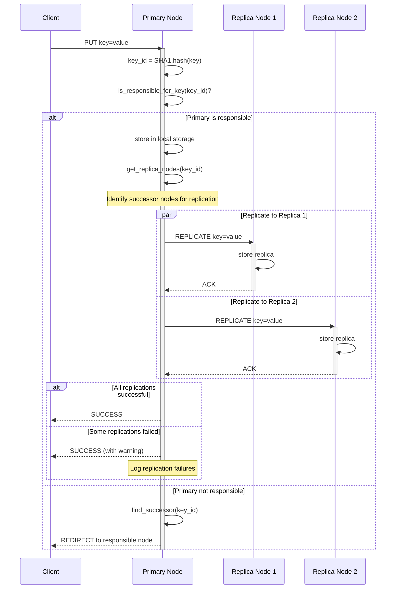
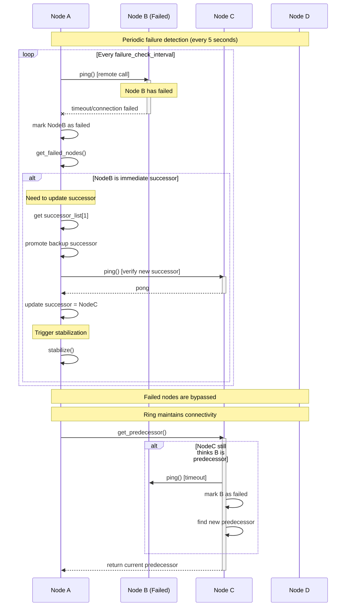
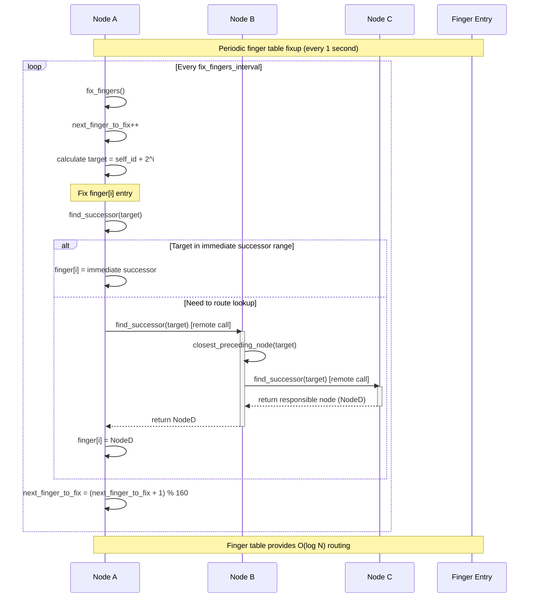

# Chord Protocol Communication Sequences

## Overview

This document provides detailed sequence diagrams and explanations for the key communication patterns in the FunnelKVS-CPP Chord DHT implementation. The Chord protocol ensures efficient distributed hash table operations through carefully orchestrated node-to-node communications.

## Key Communication Methods

### Core Chord Operations
- `find_successor(Hash160 id)` - Locates the node responsible for a given key
- `get_predecessor()` - Returns the predecessor node in the Chord ring
- `notify(NodeInfo node)` - Notifies a node of a potential new predecessor
- `stabilize()` - Periodic ring maintenance operation
- `join(NodeInfo existing_node)` - Adds a new node to an existing ring

### Network Communication Methods
- `remote_find_successor(target, id)` - Remote procedure call for successor lookup
- `remote_get_predecessor(target)` - Remote call to get predecessor information
- `remote_notify(target, node)` - Remote notification about ring changes
- `remote_ping(target)` - Health check for remote nodes

## Communication Sequence Diagrams

### 1. Node Join Operation



### 2. Key Lookup (Find Successor) Operation



### 3. Ring Stabilization Process



### 4. Data Operation with Replication



### 5. Failure Detection and Recovery



### 6. Finger Table Maintenance



## Communication Protocol Details

### Message Format
All inter-node communications use the binary protocol defined in `protocol.h`:

```
Request:  [OpCode:1][KeyLen:4][Key:variable][ValueLen:4][Value:variable]
Response: [Status:1][ValueLen:4][Value:variable]
```

### Key OpCodes for Chord Operations
- `FIND_SUCCESSOR (0x20)` - Find the node responsible for a given ID
- `FIND_PREDECESSOR (0x21)` - Find the predecessor node for a given ID  
- `GET_PREDECESSOR (0x22)` - Get the predecessor of the target node
- `GET_SUCCESSOR (0x23)` - Get the successor of the target node
- `CLOSEST_PRECEDING_NODE (0x24)` - Find closest preceding node in finger table
- `NODE_INFO (0x25)` - Get node information (ID, address, port)
- `NOTIFY (0x12)` - Notify a node of a potential new predecessor
- `PING (0x13)` - Health check for failure detection
- `REPLICATE (0x14)` - Replicate data to successor nodes

### Error Handling and Timeouts
- **Connection Timeouts**: 5 seconds for establishing connections
- **Request Timeouts**: 3 seconds for RPC operations  
- **Retry Logic**: Up to 3 retries for critical operations
- **Failure Detection**: Nodes marked as failed after 3 consecutive ping failures
- **Network Partitions**: Detected through consistent ping failures across multiple nodes

## Performance Characteristics

### Routing Efficiency
- **Average Hops**: O(log N) for key lookups using finger tables
- **Stabilization Overhead**: Each node contacts O(log N) nodes periodically
- **Failure Recovery Time**: 2-3 stabilization periods (2-6 seconds)

### Scalability
- **Ring Join Cost**: O(log^2 N) messages to initialize finger tables
- **Maintenance Overhead**: O(log N) messages per node per period
- **Storage Load**: Keys distributed uniformly across N nodes

### Network Communication Patterns
- **Chord Maintenance**: Background periodic messages (1-5 second intervals)
- **Data Operations**: On-demand routing with potential redirects
- **Failure Detection**: Periodic health checks between adjacent nodes
- **Replication**: Synchronous for consistency, asynchronous for performance

This communication architecture provides efficient distributed hash table operations while maintaining strong consistency and fault tolerance through carefully orchestrated node interactions.