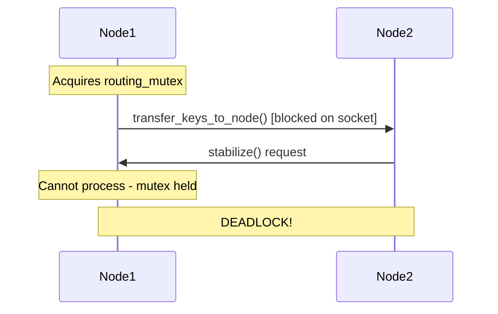
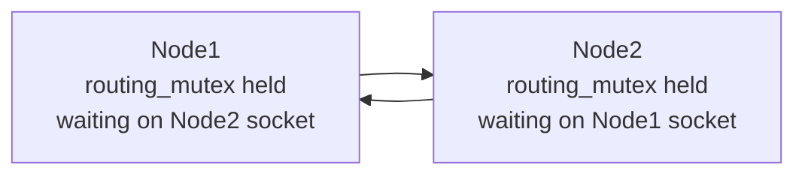

# Concurrency Control Implementation Analysis

## Overview

This document analyzes the concurrency control mechanisms in the FunnelKVS-CPP implementation, focusing on potential deadlock scenarios, especially those that can occur across multiple nodes in the distributed system.

## Mutex Inventory

### ChordNode Mutexes

1. **routing_mutex** (`mutable std::mutex`)
   - Protects: successor_list, predecessor, finger_table, next_finger_to_fix
   - Used in: find_successor, find_predecessor, stabilize, notify, etc.

2. **shutdown_mutex** (`std::mutex`)
   - Protects: shutdown coordination
   - Used with: shutdown_cv condition variable

### Storage Mutex

3. **Storage::mutex** (`mutable std::mutex`)
   - Protects: internal data map
   - Used in: get, put, remove, clear, size, exists, get_all_keys, get_all_data, get_keys_in_range

### ReplicationManager Mutex

4. **ReplicationManager::mutex** (`mutable std::mutex`)
   - Protects: replication operations coordination
   - Used in: replicate_put, replicate_delete, handle_replica_failure

### FailureDetector Mutex

5. **FailureDetector::mutex** (`mutable std::mutex`)
   - Protects: node_statuses map
   - Used in: ping_node, is_node_failed, mark_node_failed, mark_node_responsive

### Server Mutex

6. **Server::queue_mutex** (`std::mutex`)
   - Protects: client request queue
   - Used in: worker thread operations

## Critical Deadlock Scenarios

### 1. Node Leave Operation Deadlock

**Location**: `ChordNode::leave()` at src/chord.cpp:87-97

```cpp
void ChordNode::leave() {
    stop_maintenance();
    
    std::lock_guard<std::mutex> lock(routing_mutex);  // HOLDS LOCK
    
    if (successor_list[0] && *successor_list[0] != self_info) {
        transfer_keys_to_node(successor_list[0]);  // NETWORK CALLS WITH LOCK HELD!
    }
}
```

**Problem**: 
- Holds `routing_mutex` while calling `transfer_keys_to_node()`
- `transfer_keys_to_node()` makes multiple network calls via `send_key_transfer()`
- Each network call can block on socket operations
- If the target node tries to communicate back (e.g., stabilize, find_successor), it will deadlock

**Deadlock Scenario**:


### 2. Replication Manager Deadlock

**Location**: `ReplicationManager::replicate_put()` at src/replication.cpp:12-50

```cpp
bool ReplicationManager::replicate_put(...) {
    std::lock_guard<std::mutex> lock(mutex);  // HOLDS LOCK
    
    for (int i = 0; i < required_replications; ++i) {
        if (send_replication_request(replicas[i], "PUT", key, value)) {  // NETWORK CALL!
            successful_replications++;
        }
    }
    // ...
}
```

**Problem**:
- Holds `ReplicationManager::mutex` during multiple network operations
- Network calls can block indefinitely
- Prevents other replication operations from proceeding

### 3. Cross-Node Circular Dependencies

**Potential Scenario**: Two-node circular wait



This can occur when:
1. Node1 calls `find_successor()` which holds `routing_mutex` and contacts Node2
2. Node2 simultaneously calls `find_successor()` which holds its `routing_mutex` and contacts Node1
3. Both nodes are waiting on socket operations while holding their mutexes

## Lock Acquisition Patterns

### Safe Patterns (No Network Calls While Holding Locks)

1. **Storage Operations**
   - All storage operations hold `Storage::mutex` briefly
   - No network calls made while holding the lock
   - Example: `Storage::put()`, `Storage::get()`

2. **FailureDetector::ping_node()**
   ```cpp
   void FailureDetector::ping_node(std::shared_ptr<NodeInfo> node) {
       bool is_responsive = ping_node_impl(node);  // Network call BEFORE lock
       
       std::lock_guard<std::mutex> lock(mutex);    // Lock AFTER network call
       // Update status...
   }
   ```

### Unsafe Patterns (Network Calls While Holding Locks)

1. **ChordNode::leave()** - Detailed above
2. **ReplicationManager::replicate_put/delete()** - Detailed above
3. **ChordNode::find_successor()** (partial risk)
   ```cpp
   std::shared_ptr<NodeInfo> ChordNode::find_successor(const Hash160& id) {
       std::lock_guard<std::mutex> lock(routing_mutex);
       // ...
       if (closest && *closest != self_info) {
           return contact_node(closest, "find_successor", id);  // Network call with lock held
       }
   }
   ```

## Recommended Fixes

### Fix 1: Release Lock Before Network Operations

**For ChordNode::leave()**:
```cpp
void ChordNode::leave() {
    stop_maintenance();
    
    std::shared_ptr<NodeInfo> successor_to_transfer;
    {
        std::lock_guard<std::mutex> lock(routing_mutex);
        if (successor_list[0] && *successor_list[0] != self_info) {
            successor_to_transfer = successor_list[0];
        }
    }
    
    // Transfer keys without holding lock
    if (successor_to_transfer) {
        transfer_keys_to_node(successor_to_transfer);
    }
}
```

### Fix 2: Use Timeouts for Network Operations

All network operations should have reasonable timeouts to prevent indefinite blocking:
```cpp
// In send_key_transfer()
struct timeval timeout;
timeout.tv_sec = 5;   // 5 second timeout
timeout.tv_usec = 0;
setsockopt(socket_fd, SOL_SOCKET, SO_SNDTIMEO, &timeout, sizeof(timeout));
```

### Fix 3: Implement Lock-Free Replication Queue

Instead of holding locks during replication:
```cpp
class ReplicationManager {
    std::atomic<bool> processing;
    std::queue<ReplicationTask> pending_tasks;
    
    void enqueue_replication(const ReplicationTask& task) {
        // Add to queue without network calls
    }
    
    void process_replications() {
        // Process queue in background thread
    }
};
```

## Lock Ordering Protocol

To prevent deadlocks, establish a global lock ordering:

1. **Level 1**: Server::queue_mutex
2. **Level 2**: ChordNode::routing_mutex
3. **Level 3**: Storage::mutex
4. **Level 4**: ReplicationManager::mutex
5. **Level 5**: FailureDetector::mutex

**Rule**: Always acquire higher-level locks before lower-level locks.

## Testing Recommendations

1. **Deadlock Detection Tests**
   - Create scenarios with simultaneous node joins/leaves
   - Test with network delays and timeouts
   - Use thread sanitizer tools

2. **Stress Testing**
   - High concurrency with multiple nodes
   - Frequent topology changes
   - Network partition scenarios

## Conclusion

The current implementation has several critical deadlock risks, primarily caused by holding mutexes while performing network operations. The most severe is in `ChordNode::leave()` where the routing_mutex is held during the entire key transfer process. These issues can cause the entire distributed system to deadlock under certain timing conditions.

Priority fixes:
1. **CRITICAL**: Fix `ChordNode::leave()` to release mutex before network operations
2. **HIGH**: Fix `ReplicationManager` to use asynchronous replication
3. **MEDIUM**: Add timeouts to all network operations
4. **LOW**: Refactor `find_successor()` to minimize lock holding time