# FunnelKVS-CPP Detailed Design Documentation

## Class Diagram

```mermaid
classDiagram
    %% Core Server Architecture
    class Server {
        #Storage storage
        #ThreadPool thread_pool
        #int server_fd
        #atomic~bool~ running
        #thread accept_thread
        #uint16_t port
        +Server(port, num_threads)
        +~Server() virtual
        +start() virtual
        +stop() virtual
        +is_running() bool
        #process_request(client_fd, request) virtual
        #accept_loop()
        #handle_client(client_fd)
        #receive_data(fd, buffer, size) bool
        #send_data(fd, data) bool
        -setup_server_socket()
    }

    class ThreadPool {
        -vector~thread~ workers
        -queue~function~ tasks
        -mutex queue_mutex
        -condition_variable condition
        -atomic~bool~ stop
        +ThreadPool(num_threads)
        +~ThreadPool()
        +enqueue(task)
        -worker_thread()
    }

    class Storage {
        -unordered_map~string, vector~uint8_t~~ data
        -mutable mutex mutex
        +Storage()
        +~Storage()
        +get(key, value) bool
        +put(key, value)
        +remove(key) bool
        +clear()
        +size() size_t
        +exists(key) bool
        +get_all_keys() vector~string~
        +get_all_data() unordered_map
        +get_keys_in_range(predicate) unordered_map
    }

    %% Chord DHT Implementation
    class ChordServer {
        -unique_ptr~ChordNode~ chord_node
        -bool chord_enabled
        +ChordServer(address, port, num_threads)
        +~ChordServer()
        +setup_chord_node(address)
        +enable_chord()
        +disable_chord()
        +create_ring()
        +join_ring(known_address, known_port)
        +leave_ring()
        +get_node_info() NodeInfo
        +start() override
        +stop() override
        #process_request(client_fd, request) override
        -handle_chord_operation(request, response) bool
        -remote_find_successor(target, id) shared_ptr~NodeInfo~
        -remote_get_predecessor(target) shared_ptr~NodeInfo~
        -remote_notify(target, node) bool
        -remote_ping(target) bool
    }

    class ChordNode {
        -NodeInfo self_info
        -shared_ptr~NodeInfo~ predecessor
        -vector~shared_ptr~NodeInfo~~ successor_list
        -vector~shared_ptr~NodeInfo~~ finger_table
        -mutable mutex routing_mutex
        -unique_ptr~Storage~ local_storage
        -unique_ptr~ReplicationManager~ replication_manager
        -unique_ptr~FailureDetector~ failure_detector
        -atomic~bool~ running
        -thread stabilize_thread
        -thread fix_fingers_thread
        -thread failure_detection_thread
        -mutex shutdown_mutex
        -condition_variable shutdown_cv
        +ChordNode(address, port)
        +~ChordNode()
        +create()
        +join(existing_node)
        +leave()
        +start_maintenance()
        +stop_maintenance()
        +find_successor(id) shared_ptr~NodeInfo~
        +find_predecessor(id) shared_ptr~NodeInfo~
        +closest_preceding_node(id) shared_ptr~NodeInfo~
        +get_predecessor() shared_ptr~NodeInfo~
        +get_successor() shared_ptr~NodeInfo~
        +notify(node)
        +stabilize()
        +fix_fingers()
        +is_responsible_for_key(key_id) bool
        +store_key(key, value) bool
        +retrieve_key(key, value) bool
        +remove_key(key) bool
        +get_replica_nodes(key_id) vector
        +handle_node_failure(failed_node)
        +trigger_re_replication()
        +transfer_keys_to_node(target_node)
        +receive_transferred_key(key, value)
        +verify_and_repair_replicas()
        -send_key_transfer(target, key, value) bool
        -initialize_finger_table()
        -update_finger_table_entry(index, node)
        -stabilize_loop()
        -fix_fingers_loop()
        -failure_detection_loop()
        -get_finger_start(index) Hash160
        -contact_node(node, operation, param) shared_ptr~NodeInfo~
        -ping_node(node) bool
        -get_successor_nodes(count) vector
        -interruptible_sleep(duration) bool
    }

    class NodeInfo {
        +Hash160 id
        +string address
        +uint16_t port
        +to_string()
        +from_address(addr, port)$
        +operator==(other)
        +operator!=(other)
    }

    %% Replication System
    class ReplicationManager {
        -ReplicationConfig config
        -mutable mutex mutex
        -unordered_map~string, time_point~ replication_timestamps
        -queue~ReplicationTask~ pending_tasks
        -mutex queue_mutex
        -condition_variable queue_cv
        -atomic~bool~ running
        -thread processing_thread
        +ReplicationManager()
        +ReplicationManager(config)
        +~ReplicationManager()
        +replicate_put(key, value, replicas) bool
        +replicate_delete(key, replicas) bool
        +get_from_replicas(key, value, replicas) bool
        +handle_replica_failure(failed_node, new_replicas, keys_to_replicate)
        +set_replication_factor(factor)
        +get_replication_factor() int
        +get_replication_count() size_t
        +ping_node(node) bool
        +start_async_processing()
        +stop_async_processing()
        -send_replication_request(target, operation, key, value) bool
        -enqueue_replication_task(task)
        -process_replication_queue()
        -process_single_task(task) bool
    }

    class ReplicationTask {
        +TaskType type
        +string key
        +vector~uint8_t~ value
        +vector~shared_ptr~NodeInfo~~ replicas
        +int retry_count
        +ReplicationTask(type, key, value, replicas)
    }

    class FailureDetector {
        -FailureConfig config
        -mutable mutex mutex
        -unordered_map~string, NodeStatus~ node_statuses
        +FailureDetector()
        +FailureDetector(config)
        +~FailureDetector()
        +ping_node(node)
        +mark_node_responsive(node)
        +mark_node_failed(node)
        +is_node_failed(node) bool
        +is_node_suspected(node) bool
        +get_failed_nodes() vector
        +cleanup_old_entries(max_age)
        -get_node_key(node) string
        -ping_node_impl(node) bool
    }

    %% Client and Protocol
    class Client {
        -string server_host
        -uint16_t server_port
        -int socket_fd
        -bool connected
        +Client(host, port)
        +~Client()
        +connect() bool
        +disconnect()
        +is_connected() bool
        +put(key, value) bool
        +get(key, value) bool
        +remove(key) bool
        +ping() bool
        +admin_shutdown() bool
        -send_request(request, response) bool
        -send_data(data) bool
        -receive_data(buffer, size) bool
    }

    class Protocol {
        +encodeRequest(request)$ vector~uint8_t~
        +decodeRequest(data, request)$ bool
        +encodeResponse(response)$ vector~uint8_t~
        +decodeResponse(data, response)$ bool
        -readUInt32BE(data, offset)$ uint32_t
        -writeUInt32BE(value, data, offset)$
    }

    %% Hash and Utilities
    class SHA1 {
        +hash(input)$ Hash160
        +hash(data, size)$ Hash160
        +to_string(hash)$ string
        +from_string(hex_str)$ Hash160
        -process_block(block, h)$
        -pad_message(input, padded)$
    }

    %% Data Structures
    class Request {
        +OpCode opcode
        +vector<uint8_t> key
        +vector<uint8_t> value
    }

    class Response {
        +StatusCode status
        +vector<uint8_t> value
    }

    %% Relationships
    Server <|-- ChordServer : inheritance
    Server o-- ThreadPool : composition
    Server o-- Storage : composition
    ChordServer o-- ChordNode : composition
    ChordNode o-- NodeInfo : composition
    ChordNode o-- Storage : composition
    ChordNode o-- ReplicationManager : composition
    ChordNode o-- FailureDetector : composition
    ReplicationManager o-- ReplicationTask : uses
    Client ..> Protocol : uses
    Client ..> Request : creates
    Client ..> Response : receives
    ChordServer ..> Protocol : uses
    NodeInfo ..> SHA1 : uses
    ChordNode ..> SHA1 : uses

    %% Enums
    class OpCode {
        <<enumeration>>
        GET
        PUT
        DELETE
        JOIN
        STABILIZE
        NOTIFY
        PING
        REPLICATE
        TRANSFER_KEY
        FIND_SUCCESSOR
        FIND_PREDECESSOR
        GET_PREDECESSOR
        GET_SUCCESSOR
        CLOSEST_PRECEDING_NODE
        NODE_INFO
        ADMIN_SHUTDOWN
    }

    class StatusCode {
        <<enumeration>>
        SUCCESS
        KEY_NOT_FOUND
        ERROR
        REDIRECT
    }
```



## Multi-threading Architecture & Concurrency Control

### Thread Model Overview

The FunnelKVS-CPP system employs a sophisticated multi-threaded architecture designed for high concurrent performance while maintaining data consistency. The threading model consists of several distinct layers:

1. **Server Layer Threading**
2. **Chord DHT Threading**
3. **Client Connection Threading**
4. **Background Maintenance Threading**

### Critical Shared Data & Synchronization Strategy

#### 1. Storage Layer (`Storage` class)
**Protected Data:**
- `std::unordered_map<std::string, std::vector<uint8_t>> data` - The main key-value storage

**Synchronization Mechanism:**
- **Mutex Type:** `mutable std::mutex mutex`
- **Strategy:** Fine-grained locking using RAII pattern with `std::lock_guard`
- **Reasoning:** All public methods acquire the mutex before accessing the hash map. Uses `mutable` to allow const methods to lock, enabling thread-safe read operations.

**New Methods for Data Transfer:**
- `get_all_keys()` - Returns all keys for migration
- `get_all_data()` - Returns complete data snapshot
- `get_keys_in_range()` - Filters keys based on predicate for selective transfer

```cpp
// Example synchronization pattern
bool Storage::get(const std::string& key, std::vector<uint8_t>& value) const {
    std::lock_guard<std::mutex> lock(mutex);
    // Thread-safe access to data
}
```

#### 2. Chord Routing Table (`ChordNode` class)
**Protected Data:**
- `std::shared_ptr<NodeInfo> predecessor` - Node's predecessor in the ring
- `std::vector<std::shared_ptr<NodeInfo>> successor_list` - Successor nodes for fault tolerance
- `std::vector<std::shared_ptr<NodeInfo>> finger_table` - Routing table for O(log N) lookups

**Synchronization Mechanism:**
- **Mutex Type:** `mutable std::mutex routing_mutex`
- **Strategy:** Reader-writer pattern using shared mutex semantics
- **Reasoning:** The routing information is frequently read during request routing but infrequently updated during maintenance. The mutex ensures atomicity of routing table updates while allowing concurrent reads.

#### 3. Thread Pool Work Queue (`ThreadPool` class)
**Protected Data:**
- `std::queue<std::function<void()>> tasks` - Queue of pending work items

**Synchronization Mechanism:**
- **Mutex Type:** `std::mutex queue_mutex`
- **Condition Variable:** `std::condition_variable condition`
- **Atomic Control:** `std::atomic<bool> stop`
- **Strategy:** Producer-consumer pattern with condition variables
- **Reasoning:** Multiple worker threads compete for tasks from the queue. Condition variables provide efficient blocking/waking of idle threads.

```cpp
template<typename F>
void ThreadPool::enqueue(F&& f) {
    {
        std::unique_lock<std::mutex> lock(queue_mutex);
        if(stop) return;
        tasks.emplace(std::forward<F>(f));
    }
    condition.notify_one();
}
```

#### 4. Replication Manager (`ReplicationManager` class)
**Protected Data:**
- `std::unordered_map<std::string, std::chrono::steady_clock::time_point> replication_timestamps` - Tracking of replication timing
- `std::queue<ReplicationTask> pending_tasks` - Queue for asynchronous replication tasks
- `std::atomic<bool> running` - Control flag for background processing thread

**Synchronization Mechanism:**
- **Metadata Mutex:** `mutable std::mutex mutex` for timestamps
- **Queue Mutex:** `std::mutex queue_mutex` for task queue
- **Condition Variable:** `std::condition_variable queue_cv` for task processing coordination
- **Background Thread:** `std::thread processing_thread` for async replication
- **Strategy:** Lock-free async replication to prevent deadlocks during network operations
- **Reasoning:** Network operations in replication can block; async queue prevents holding locks during network calls.

#### 5. Failure Detection (`FailureDetector` class)
**Protected Data:**
- `std::unordered_map<std::string, std::chrono::steady_clock::time_point> last_seen` - Node heartbeat tracking

**Synchronization Mechanism:**
- **Mutex Type:** `mutable std::mutex mutex`
- **Strategy:** Fine-grained locking with timeout-based cleanup
- **Reasoning:** Failure detection requires atomic updates to heartbeat timestamps and consistent reads for failure detection logic.

### Threading Architecture Details

#### 1. Server Accept Thread
- **Purpose:** Dedicated thread for accepting incoming TCP connections
- **Implementation:** `std::thread accept_thread` in `Server` class
- **Lifecycle:** Started in `Server::start()`, stopped in `Server::stop()`
- **Synchronization:** Uses `std::atomic<bool> running` for thread-safe shutdown signaling

#### 2. Worker Thread Pool
- **Purpose:** Process client requests concurrently
- **Implementation:** `ThreadPool` class with configurable worker count
- **Pattern:** Each worker thread runs in a loop, taking tasks from the shared queue
- **Load Balancing:** Work-stealing pattern ensures even distribution of client requests

#### 3. Chord Maintenance Threads (per `ChordNode`)
The Chord DHT requires continuous background maintenance for correctness:

**a. Stabilization Thread (`stabilize_thread`)**
- **Purpose:** Maintains correct successor relationships in the Chord ring
- **Frequency:** Configurable interval (default: 1 second)
- **Synchronization:** Acquires `routing_mutex` when updating successor information

**b. Finger Table Fixup Thread (`fix_fingers_thread`)**
- **Purpose:** Periodically updates finger table entries for optimal routing
- **Frequency:** Configurable interval (default: 1 second)
- **Pattern:** Round-robin finger table entry updates

**c. Failure Detection Thread (`failure_detection_thread`)**
- **Purpose:** Monitors node health and handles failure detection
- **Frequency:** Configurable interval (default: 5 seconds)
- **Coordination:** Works with `FailureDetector` to maintain cluster health

#### 4. Thread Coordination and Shutdown
**Enhanced Graceful Shutdown Pattern:**
- All threads use `std::atomic<bool>` flags for shutdown coordination
- Condition variables (`std::condition_variable shutdown_cv`) allow interruptible waits
- **Network Operation Shutdown Checks:** Threads check `running.load()` before network operations
- **Thread Detachment:** Uses `detach()` instead of `join()` to prevent blocking on stuck network operations
- **Replication Thread Shutdown:** ReplicationManager background thread is explicitly stopped first
- RAII ensures proper resource cleanup when threads terminate

```cpp
// Enhanced shutdown coordination with deadlock prevention
void ChordNode::stop_maintenance() {
    running.store(false);
    
    // Stop replication manager background thread first
    if (replication_manager) {
        replication_manager->stop_async_processing();
    }
    
    shutdown_cv.notify_all();
    
    // Detach threads instead of joining to prevent hanging on network operations
    if (stabilize_thread.joinable()) stabilize_thread.detach();
    if (fix_fingers_thread.joinable()) fix_fingers_thread.detach();
    if (failure_detection_thread.joinable()) failure_detection_thread.detach();
    
    // Brief delay to allow threads to see shutdown signal
    std::this_thread::sleep_for(std::chrono::milliseconds(100));
}
```

### Concurrency Design Principles & Deadlock Prevention

#### 1. Enhanced Lock Hierarchy
The system follows a consistent lock ordering to prevent deadlocks:
1. **Server-level locks** (ThreadPool queue mutex)
2. **Chord routing locks** (routing_mutex)
3. **Storage locks** (Storage mutex)
4. **Replication metadata locks** (ReplicationManager mutex)
5. **Replication queue locks** (ReplicationManager queue_mutex)

#### 2. Lock-Free Network Operations (Critical Deadlock Prevention)
**Problem:** Holding mutexes during network operations can cause distributed deadlocks
**Solutions Implemented:**
- **ChordNode::leave()**: Releases `routing_mutex` before calling `transfer_keys_to_node()`
- **ReplicationManager**: Uses asynchronous queue to avoid holding locks during replication network calls
- **Maintenance Threads**: Check `running.load()` before network operations to exit quickly during shutdown

```cpp
// Example: Lock-free network operation pattern
void ChordNode::stabilize() {
    if (!running.load()) return;  // Quick shutdown check
    
    std::shared_ptr<NodeInfo> successor;
    {
        std::lock_guard<std::mutex> lock(routing_mutex);
        successor = successor_list[0];
    }  // Lock released before network operation
    
    if (!running.load()) return;  // Check again before network call
    auto x = contact_node(successor, "get_predecessor");  // Network I/O without lock
    
    // Re-acquire lock only for data updates
    {
        std::lock_guard<std::mutex> lock(routing_mutex);
        if (x && valid_update_condition) {
            successor_list[0] = x;
        }
    }
}
```

#### 3. Network Operation Timeouts
**5-Second Timeout Protection:**
- All socket operations have 5-second send/receive timeouts via `SO_SNDTIMEO`/`SO_RCVTIMEO`
- Client connections use non-blocking connect with 1-second timeout
- Server client handlers set timeouts on accepted connections
- Prevents indefinite blocking on network operations to failed nodes

#### 4. Asynchronous Replication Queue System
**Lock-Free Replication Strategy:**
- ReplicationManager uses background thread with task queue
- Replication requests are enqueued without holding locks
- Network operations are performed in dedicated thread context
- Retry mechanism with configurable max attempts
- Prevents blocking main thread on replication network calls

#### 5. Lock Duration Minimization
- All critical sections are kept as short as possible
- Long-running operations (network I/O) are performed outside of critical sections
- Copy-on-read pattern for shared data structures when appropriate

#### 6. Atomic Operations
- Control flags use `std::atomic<bool>` to avoid lock overhead for simple state checks
- Reference counting for shared node information uses `std::shared_ptr` built-in atomic reference counting
- Background thread control uses atomic flags for lock-free shutdown coordination

#### 7. Thread-Safe Design Patterns
- **RAII:** All locks use RAII pattern with `std::lock_guard` and `std::unique_lock`
- **Immutable Data:** Node identifiers and hash values are immutable after creation
- **Copy Semantics:** Shared data is copied when crossing thread boundaries to minimize lock contention
- **Condition Variables:** Used for efficient thread coordination in queues and shutdown

### Performance Considerations

#### 1. Read-Heavy Optimization
- Storage operations are optimized for concurrent reads with minimal lock contention
- Chord routing table reads are highly concurrent using shared mutex semantics

#### 2. Write Path Optimization
- Updates to critical data structures are batched when possible
- Replication is performed asynchronously to avoid blocking the primary write path

#### 3. Memory Management
- Extensive use of `std::shared_ptr` for automatic memory management in concurrent environment
- Lock-free reference counting reduces contention for shared node information

This multi-threaded architecture provides high concurrency while maintaining strong consistency guarantees, making FunnelKVS-CPP suitable for high-performance distributed applications.