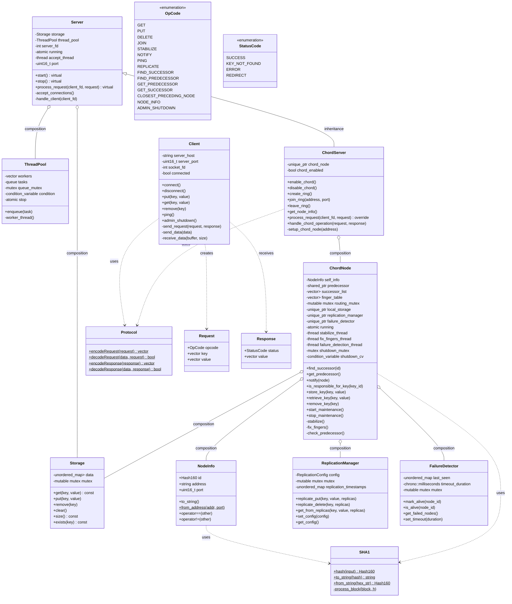

# FunnelKVS-CPP Detailed Design Documentation

## Class Diagram



## Multi-threading Architecture & Concurrency Control

### Thread Model Overview

The FunnelKVS-CPP system employs a sophisticated multi-threaded architecture designed for high concurrent performance while maintaining data consistency. The threading model consists of several distinct layers:

1. **Server Layer Threading**
2. **Chord DHT Threading**
3. **Client Connection Threading**
4. **Background Maintenance Threading**

### Critical Shared Data & Synchronization Strategy

#### 1. Storage Layer (`Storage` class)
**Protected Data:**
- `std::unordered_map<std::string, std::vector<uint8_t>> data` - The main key-value storage

**Synchronization Mechanism:**
- **Mutex Type:** `mutable std::mutex mutex`
- **Strategy:** Fine-grained locking using RAII pattern with `std::lock_guard`
- **Reasoning:** All public methods acquire the mutex before accessing the hash map. Uses `mutable` to allow const methods to lock, enabling thread-safe read operations.

```cpp
// Example synchronization pattern
bool Storage::get(const std::string& key, std::vector<uint8_t>& value) const {
    std::lock_guard<std::mutex> lock(mutex);
    // Thread-safe access to data
}
```

#### 2. Chord Routing Table (`ChordNode` class)
**Protected Data:**
- `std::shared_ptr<NodeInfo> predecessor` - Node's predecessor in the ring
- `std::vector<std::shared_ptr<NodeInfo>> successor_list` - Successor nodes for fault tolerance
- `std::vector<std::shared_ptr<NodeInfo>> finger_table` - Routing table for O(log N) lookups

**Synchronization Mechanism:**
- **Mutex Type:** `mutable std::mutex routing_mutex`
- **Strategy:** Reader-writer pattern using shared mutex semantics
- **Reasoning:** The routing information is frequently read during request routing but infrequently updated during maintenance. The mutex ensures atomicity of routing table updates while allowing concurrent reads.

#### 3. Thread Pool Work Queue (`ThreadPool` class)
**Protected Data:**
- `std::queue<std::function<void()>> tasks` - Queue of pending work items

**Synchronization Mechanism:**
- **Mutex Type:** `std::mutex queue_mutex`
- **Condition Variable:** `std::condition_variable condition`
- **Atomic Control:** `std::atomic<bool> stop`
- **Strategy:** Producer-consumer pattern with condition variables
- **Reasoning:** Multiple worker threads compete for tasks from the queue. Condition variables provide efficient blocking/waking of idle threads.

```cpp
template<typename F>
void ThreadPool::enqueue(F&& f) {
    {
        std::unique_lock<std::mutex> lock(queue_mutex);
        if(stop) return;
        tasks.emplace(std::forward<F>(f));
    }
    condition.notify_one();
}
```

#### 4. Replication Manager (`ReplicationManager` class)
**Protected Data:**
- `std::unordered_map<std::string, std::chrono::steady_clock::time_point> replication_timestamps` - Tracking of replication timing

**Synchronization Mechanism:**
- **Mutex Type:** `mutable std::mutex mutex`
- **Strategy:** Coarse-grained locking for replication metadata
- **Reasoning:** Replication operations are less frequent than read/write operations, so coarse-grained locking is acceptable for simplicity.

#### 5. Failure Detection (`FailureDetector` class)
**Protected Data:**
- `std::unordered_map<std::string, std::chrono::steady_clock::time_point> last_seen` - Node heartbeat tracking

**Synchronization Mechanism:**
- **Mutex Type:** `mutable std::mutex mutex`
- **Strategy:** Fine-grained locking with timeout-based cleanup
- **Reasoning:** Failure detection requires atomic updates to heartbeat timestamps and consistent reads for failure detection logic.

### Threading Architecture Details

#### 1. Server Accept Thread
- **Purpose:** Dedicated thread for accepting incoming TCP connections
- **Implementation:** `std::thread accept_thread` in `Server` class
- **Lifecycle:** Started in `Server::start()`, stopped in `Server::stop()`
- **Synchronization:** Uses `std::atomic<bool> running` for thread-safe shutdown signaling

#### 2. Worker Thread Pool
- **Purpose:** Process client requests concurrently
- **Implementation:** `ThreadPool` class with configurable worker count
- **Pattern:** Each worker thread runs in a loop, taking tasks from the shared queue
- **Load Balancing:** Work-stealing pattern ensures even distribution of client requests

#### 3. Chord Maintenance Threads (per `ChordNode`)
The Chord DHT requires continuous background maintenance for correctness:

**a. Stabilization Thread (`stabilize_thread`)**
- **Purpose:** Maintains correct successor relationships in the Chord ring
- **Frequency:** Configurable interval (default: 1 second)
- **Synchronization:** Acquires `routing_mutex` when updating successor information

**b. Finger Table Fixup Thread (`fix_fingers_thread`)**
- **Purpose:** Periodically updates finger table entries for optimal routing
- **Frequency:** Configurable interval (default: 1 second)
- **Pattern:** Round-robin finger table entry updates

**c. Failure Detection Thread (`failure_detection_thread`)**
- **Purpose:** Monitors node health and handles failure detection
- **Frequency:** Configurable interval (default: 5 seconds)
- **Coordination:** Works with `FailureDetector` to maintain cluster health

#### 4. Thread Coordination and Shutdown
**Graceful Shutdown Pattern:**
- All threads use `std::atomic<bool>` flags for shutdown coordination
- Condition variables (`std::condition_variable shutdown_cv`) allow interruptible waits
- RAII ensures proper resource cleanup when threads terminate

```cpp
// Example shutdown coordination
void ChordNode::stop_maintenance() {
    {
        std::lock_guard<std::mutex> lock(shutdown_mutex);
        running = false;
    }
    shutdown_cv.notify_all();
    
    if (stabilize_thread.joinable()) stabilize_thread.join();
    if (fix_fingers_thread.joinable()) fix_fingers_thread.join();
    if (failure_detection_thread.joinable()) failure_detection_thread.join();
}
```

### Concurrency Design Principles

#### 1. Lock Hierarchy
The system follows a consistent lock ordering to prevent deadlocks:
1. **Server-level locks** (ThreadPool queue mutex)
2. **Chord routing locks** (routing_mutex)
3. **Storage locks** (Storage mutex)
4. **Replication metadata locks** (ReplicationManager mutex)

#### 2. Lock Duration Minimization
- All critical sections are kept as short as possible
- Long-running operations (network I/O) are performed outside of critical sections
- Copy-on-read pattern for shared data structures when appropriate

#### 3. Atomic Operations
- Control flags use `std::atomic<bool>` to avoid lock overhead for simple state checks
- Reference counting for shared node information uses `std::shared_ptr` built-in atomic reference counting

#### 4. Thread-Safe Design Patterns
- **RAII:** All locks use RAII pattern with `std::lock_guard` and `std::unique_lock`
- **Immutable Data:** Node identifiers and hash values are immutable after creation
- **Copy Semantics:** Shared data is copied when crossing thread boundaries to minimize lock contention

### Performance Considerations

#### 1. Read-Heavy Optimization
- Storage operations are optimized for concurrent reads with minimal lock contention
- Chord routing table reads are highly concurrent using shared mutex semantics

#### 2. Write Path Optimization
- Updates to critical data structures are batched when possible
- Replication is performed asynchronously to avoid blocking the primary write path

#### 3. Memory Management
- Extensive use of `std::shared_ptr` for automatic memory management in concurrent environment
- Lock-free reference counting reduces contention for shared node information

This multi-threaded architecture provides high concurrency while maintaining strong consistency guarantees, making FunnelKVS-CPP suitable for high-performance distributed applications.